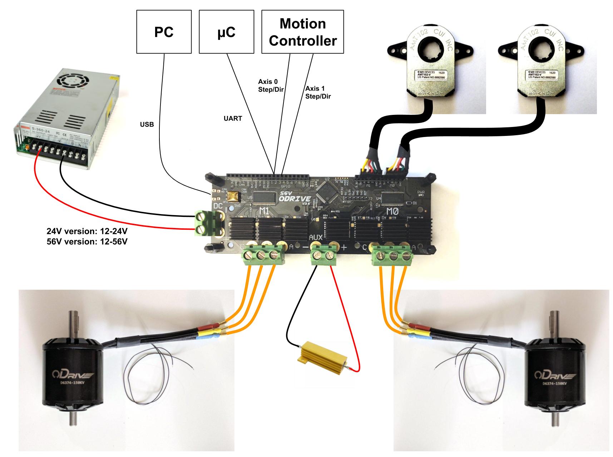

# Reproduction steps for motor controller calibration

## Hardware

- ODrive 3.6 56v version https://odriverobotics.com
- 2 x 6.5" 36V Hoverboard wheels (Lanba36V20B191025724/800 - SN?)
- 36V power supply
- Raspberry PI 4 running off seperate power supply to avoid ground loops

### Wiring setup

Follow [the ODrive setup guide](https://docs.odriverobotics.com/) for the hardware connection guide (diagram below)



#### Hall sensor wiring

- Red : 5V
- Yellow : A
- Blue : B
- Green : Z
- Black : GND

# Software

On Raspberry PI

```
sudo pip3 install --upgrade odrive
sudo odrivetool
```

Should now be in interactive ODrive tool ready to issue setup / calibration commands.

Hoverboard specific guide is [here](https://docs.odriverobotics.com/v/0.5.5/hoverboard.html#hoverboard-doc), info extracted and summarised for posterity. This is what worked for me and the second hand hoverboard motors after some tweaking and errors about motor phase inductance.
Set axis0 or axis1 depending on if M0 or M1 is being setup.

```
odrv0.axis0.motor.config.pole_pairs = 15

odrv0.axis0.motor.config.resistance_calib_max_voltage = 4
odrv0.axis0.motor.config.calibration_current = 5 # this was added to get calib to work - NOT IN GUIDE. default was 10
odrv0.axis0.motor.config.requested_current_range = 25 #Requires config save and reboot
odrv0.axis0.motor.config.current_control_bandwidth = 100
odrv0.axis0.motor.config.torque_constant = 8.27 / 16

odrv0.axis0.encoder.config.mode = ENCODER_MODE_HALL
odrv0.axis0.encoder.config.cpr = 90
odrv0.axis0.encoder.config.calib_scan_distance = 150
odrv0.config.gpio9_mode = GPIO_MODE_DIGITAL
odrv0.config.gpio10_mode = GPIO_MODE_DIGITAL
odrv0.config.gpio11_mode = GPIO_MODE_DIGITAL

odrv0.axis0.encoder.config.bandwidth = 100
odrv0.axis0.controller.config.pos_gain = 1
odrv0.axis0.controller.config.vel_gain = 0.02 * odrv0.axis0.motor.config.torque_constant * odrv0.axis0.encoder.config.cpr
odrv0.axis0.controller.config.vel_integrator_gain = 0.1 * odrv0.axis0.motor.config.torque_constant * odrv0.axis0.encoder.config.cpr
odrv0.axis0.controller.config.vel_limit = 10
odrv0.axis0.controller.config.control_mode = CONTROL_MODE_VELOCITY_CONTROL

odrv0.save_configuration()
odrv0.reboot()

# do the calibration
odrv0.axis0.requested_state = AXIS_STATE_MOTOR_CALIBRATION

# read out data pertaining to motor
odrv0.axis0.motor

# error should be 0x0000 and phase_inductance / phase_resistance should be set (not 0.0)
# tell the ODrive that saving this calibration to persistent memory is OK
odrv0.axis0.motor.config.pre_calibrated = True

odrv0.axis0.requested_state = AXIS_STATE_ENCODER_HALL_POLARITY_CALIBRATION

# read out status of encoder
odrv0.axis0.encoder

# error should be 0x0000

# check the alignment between the motor and the hall sensor
odrv0.axis0.requested_state = AXIS_STATE_ENCODER_OFFSET_CALIBRATION

# read out status of encoder
odrv0.axis0.encoder

# error should be 0x0000 and phase_offset_float should be -1.5, -0.5, 0.5 or 1.5
# tell the ODrive that saving this calibration to persistent memory is OK
odrv0.axis0.encoder.config.pre_calibrated = True

# Save, reboot, and test! ODrive starts in IDLE by default (can configure this), so need to enable closed loop control.
odrv0.save_configuration()
odrv0.reboot()

odrv0.axis0.requested_state = AXIS_STATE_CLOSED_LOOP_CONTROL
odrv0.axis0.controller.input_vel = 2
# Your motor should spin here!!!!
odrv0.axis0.controller.input_vel = 0
odrv0.axis0.requested_state = AXIS_STATE_IDLE
```

Repeat for axis1 (text here for easy copy-paste):


```
odrv0.axis1.motor.config.pole_pairs = 15

odrv0.axis1.motor.config.resistance_calib_max_voltage = 4
odrv0.axis1.motor.config.calibration_current = 5 # this was added to get calib to work - NOT IN GUIDE. default was 10
odrv0.axis1.motor.config.requested_current_range = 25 #Requires config save and reboot
odrv0.axis1.motor.config.current_control_bandwidth = 100
odrv0.axis1.motor.config.torque_constant = 8.27 / 16

odrv0.axis1.encoder.config.mode = ENCODER_MODE_HALL
odrv0.axis1.encoder.config.cpr = 90
odrv0.axis1.encoder.config.calib_scan_distance = 150
odrv0.config.gpio9_mode = GPIO_MODE_DIGITAL
odrv0.config.gpio10_mode = GPIO_MODE_DIGITAL
odrv0.config.gpio11_mode = GPIO_MODE_DIGITAL

odrv0.axis1.encoder.config.bandwidth = 100
odrv0.axis1.controller.config.pos_gain = 1
odrv0.axis1.controller.config.vel_gain = 0.02 * odrv0.axis0.motor.config.torque_constant * odrv0.axis0.encoder.config.cpr
odrv0.axis1.controller.config.vel_integrator_gain = 0.1 * odrv0.axis0.motor.config.torque_constant * odrv0.axis0.encoder.config.cpr
odrv0.axis1.controller.config.vel_limit = 10
odrv0.axis1.controller.config.control_mode = CONTROL_MODE_VELOCITY_CONTROL

odrv0.save_configuration()
odrv0.reboot()

# do the calibration
odrv0.axis1.requested_state = AXIS_STATE_MOTOR_CALIBRATION

# read out data pertaining to motor
odrv0.axis1.motor

# error should be 0x0000 and phase_inductance / phase_resistance should be set (not 0.0)
# tell the ODrive that saving this calibration to persistent memory is OK
odrv0.axis1.motor.config.pre_calibrated = True

odrv0.axis1.requested_state = AXIS_STATE_ENCODER_HALL_POLARITY_CALIBRATION

# read out status of encoder
odrv0.axis1.encoder

# error should be 0x0000

# check the alignment between the motor and the hall sensor
odrv0.axis1.requested_state = AXIS_STATE_ENCODER_OFFSET_CALIBRATION

# read out status of encoder
odrv0.axis1.encoder

# error should be 0x0000 and phase_offset_float should be -1.5, -0.5, 0.5 or 1.5
# tell the ODrive that saving this calibration to persistent memory is OK
odrv0.axis1.encoder.config.pre_calibrated = True

# Save, reboot, and test! ODrive starts in IDLE by default (can configure this), so need to enable closed loop control.
odrv0.save_configuration()
odrv0.reboot()

odrv0.axis1.requested_state = AXIS_STATE_CLOSED_LOOP_CONTROL
odrv0.axis1.controller.input_vel = 2
# Your motor should spin here!!!!
odrv0.axis1.controller.input_vel = 0
odrv0.axis1.requested_state = AXIS_STATE_IDLE
```

We then need to put the odrive in TORQUE_CONTROL mode with 

```
odrv0.axis0.controller.config.control_mode = ControlMode.TORQUE_CONTROL
odrv0.axis1.controller.config.control_mode = ControlMode.TORQUE_CONTROL
odrv0.axis0.controller.config.enable_torque_mode_vel_limit = False
odrv0.axis1.controller.config.enable_torque_mode_vel_limit = False

```

May also need to disable current limits